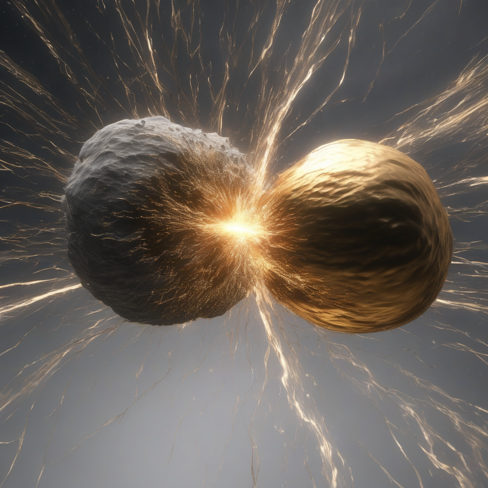

# Deep Space Diffusion

An interactive generative-AI experience that lets users explore a browser-based starfield and generate celestial imagery with a custom Stable Diffusion XL LoRA model trained on curated ESA Hubble images.

Built at HackIllinois 2026.



## Why this project matters

Deep Space Diffusion connects the full applied-ML workflow: dataset preparation, parameter-efficient model fine-tuning, GPU deployment, API inference, and an interactive frontend. It demonstrates how a generative model can be turned into a usable experience rather than remaining an isolated notebook.

## Architecture

```text
ESA Hubble dataset
        |
        v
filtering, resizing, and prompt captions
        |
        v
SDXL DreamBooth LoRA training on Modal A100
        |
        v
persistent LoRA weights and model cache
        |
        v
Modal A10G inference endpoint
        |
        v
local Python proxy
        |
        v
interactive HTML/CSS/JavaScript starfield
```

## How it works

1. `prepare_dataset` downloads the ESA Hubble dataset, selects relevant categories, removes undersized images, crops without stretching, resizes for SDXL, and preserves scientific sidecar captions.
2. `train` fine-tunes SDXL with DreamBooth LoRA for 500 steps and stores the adapter in a persistent Modal volume.
3. `CosmicHorrorGenerator` loads the base model and LoRA adapter on an A10G GPU and exposes image generation through a Modal endpoint.
4. `server.py` serves the static frontend and proxies generation requests without exposing deployment configuration in browser code.
5. The frontend maps interactive celestial objects to contextual generation prompts and renders the returned image.

## Technical details

- Base model: Stable Diffusion XL 1.0
- Adaptation: DreamBooth LoRA, rank 16
- Training resolution: 1024 x 1024
- Training budget: 500 steps, batch size 1, gradient accumulation 4
- Training GPU: Modal A100
- Inference GPU: Modal A10G
- Frontend: vanilla HTML, CSS, Canvas, and JavaScript
- Backend: Python standard-library proxy and Modal web endpoint

## Project structure

```text
.
├── cosmic_horror.py      # Dataset preparation, training, and cloud inference
├── server.py             # Static server and generation proxy
├── index.html            # Interactive application shell
├── main.js               # Starfield, interactions, and API client
├── styles.css            # Visual design and animation
├── kilonova.png          # Representative generated output
├── tests/                # Lightweight proxy tests
└── .github/workflows/    # Automated validation
```

## Run locally

### Prerequisites

- Python 3.10 or later
- A Modal account
- A configured Hugging Face secret in Modal

### Install, train, and deploy

```bash
python -m venv .venv
source .venv/bin/activate
pip install -r requirements.txt
modal run cosmic_horror.py::prepare_dataset
modal run cosmic_horror.py::train
modal deploy cosmic_horror.py
```

Copy the deployed `generate_web` endpoint and configure the proxy:

```bash
export MODAL_URL="https://your-modal-endpoint.modal.run"
python server.py
```

Then visit `http://localhost:8080`.

## Validation

The repository includes lightweight tests for endpoint configuration, prompt encoding, default behavior, and input-length validation.

```bash
python -m unittest discover -s tests -v
```

GitHub Actions also compiles the Python entry points and runs the tests on every push and pull request.

## Dataset and model notes

The training workflow uses the `Supermaxman/esa-hubble` dataset and filters it to nebulae, galaxies, quasars and black holes, cosmology, and star clusters. Source imagery and generated model weights are not committed to this repository.

Users are responsible for reviewing the source dataset, image, and base-model licenses before reproducing or redistributing derived artifacts. The repository's MIT License covers original project code only; it does not relicense datasets, pretrained models, or third-party training scripts.

## Current limitations

- The repository does not include quantitative model-quality evaluation or a held-out comparison against base SDXL.
- Scientific sidecar captions are preserved during dataset preparation, but the current DreamBooth command trains with the shared instance prompt rather than consuming those captions.
- The training script is downloaded from the upstream Diffusers branch during image construction and should be pinned to a tested revision for long-term reproducibility.
- A publicly reachable inference endpoint should add authentication, rate limiting, and cost controls before production use.
- The browser experience is a hackathon prototype and has not yet been tested for accessibility or broad device compatibility.

## Next steps

- Add matched-prompt comparisons between base SDXL and the fine-tuned LoRA
- Record training loss, latency, and approximate inference cost
- Add a gallery of representative outputs and failure cases
- Pin the Diffusers training script to a tested revision
- Add endpoint authentication and rate limiting
- Deploy a stable public demo

## License

Original project code is available under the MIT License. External data, models, and tooling retain their own licenses and terms.
